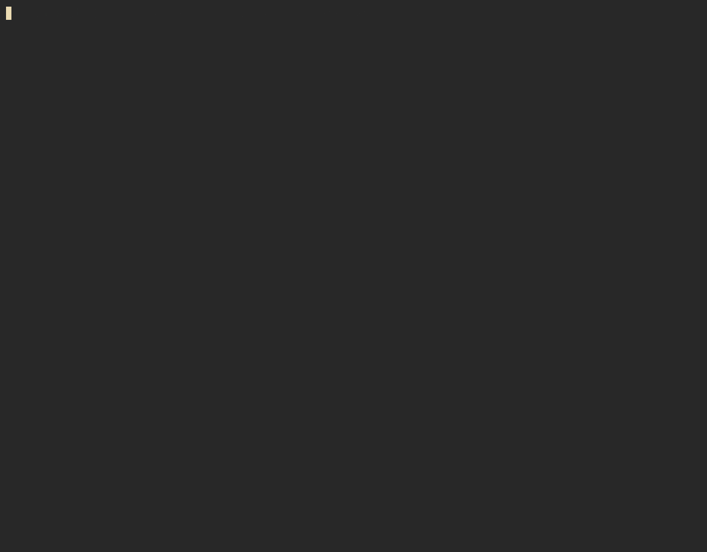

# legmacs

A little Emacs-flavored terminal editor written in
[let-go](https://github.com/nooga/let-go), almost-Clojure running on a Go
bytecode VM. Here's the fun part: the language you'd script it in is the same
language it's written in. There's no plugin API bolted on the side. Every
built-in command and key binding is defined with the exact same
`defcommand`/`bind-key!` your own config uses, so hacking on legmacs and
configuring legmacs are the same activity.



It's small. `scc` counts about 2,700 lines of Lisp for the whole editor. For
that, it does a lot more than I expected it would when I started:

- Emacs chords, kill ring, region, undo/redo, multiple buffers
- a real, extensible mode system: major and minor modes, keymaps that shadow
  the global one key by key
- syntax highlighting for let-go and Markdown
- paren matching, auto-closing brackets, and structural expand-region
- in-process eval (`C-x C-e` / `C-j`), because it's a Lisp editing a Lisp in
  the very same runtime, so `*scratch*` is a live REPL over the editor itself
- swiper-style live incremental search
- vertico/ivy-style fuzzy completion for commands, files, and buffers
- CRUTCH, a bundled vi-style modal minor mode (yes, modal editing, if you want it)
- a themeable, segment-based mode line

All of it is built on the same public API, so any feature is also a worked
example for the one you want to write.

## Install

```sh
brew install nooga/tap/legmacs
legmacs [file...]
```

That's a self-contained native binary, no runtime to install. Prebuilt
tarballs for macOS and Linux (amd64/arm64) are on the
[releases page](https://github.com/nooga/legmacs/releases/latest).

## Run from source

You'll need `lg`, the let-go runtime (`brew install nooga/tap/let-go`). Then:

```sh
lg main.lg [file...]
```

## Make it yours

Drop a `legmacs-init` namespace at `~/.config/legmacs/legmacs_init.lg`:

```clojure
(ns legmacs-init
  (:require [legmacs.keymap :as km :refer [defcommand]]))

(defcommand insert-banner "Insert a banner." [state]
  (legmacs.buffer/insert-string state "<<< hello >>>"))

(km/bind-key! "C-c b" :insert-banner)
```

Same `defcommand`/`bind-key!` the editor defines its own keys with. See
[examples/legmacs_init.example.lg](examples/legmacs_init.example.lg) for a
fuller one.

## More

The complete keymap, the mode system, the scripting API, and how it's all put
together live in [docs/GUIDE.md](docs/GUIDE.md). Tests run with
`lg test/run.lg`.

MIT licensed.
