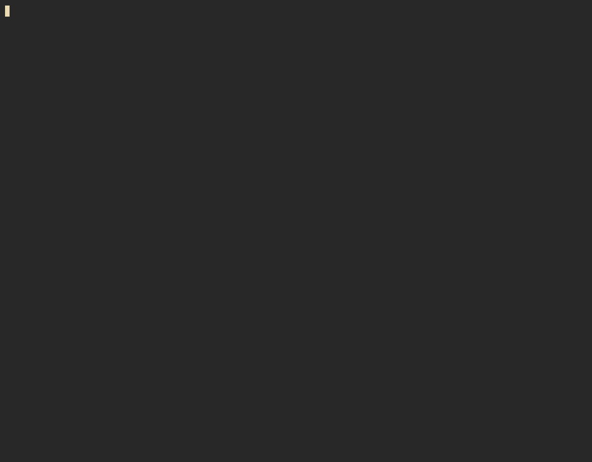

# legmacs

> 💬 Come talk about legmacs in `#legmacs` on [The Fixpoint](https://discord.gg/Ky535CQ9pj) Discord.

A little Emacs-flavored terminal editor written in
[let-go](https://github.com/nooga/let-go), almost-Clojure running on a Go
bytecode VM. Here's the fun part: the language you'd script it in is the same
language it's written in. There's no plugin API bolted on the side. Every
built-in command and key binding is defined with the exact same
`defcommand`/`bind-key!` your own config uses, so hacking on legmacs and
configuring legmacs are the same activity.



It's small. About 5,300 lines of Lisp for the whole editor, bundled modes
included. For that, it does a lot more than I expected it would when I
started:

- Emacs chords, kill ring, region, undo/redo, multiple buffers
- window splits (`C-x 2` / `C-x 3`, mix and nest them), each window with
  its own cursor and scroll
- a real, extensible mode system: major and minor modes, keymaps that shadow
  the global one key by key
- syntax highlighting for 20+ languages out of the box, plus paren
  matching, auto-closing brackets, and per-language auto-indent for all of
  them (see [Language support](#language-support)) -- and it's a one-call
  `register-prog-mode!` to add your own
- indentation that knows the language: bracket depth for C-likes, the line
  above plus keyword rules for shell/Ruby/Lua, the offside rule for Python,
  align-under-the-form for Lisp. `TAB` re-indents a line, typing a closer
  pulls its line back, and `RET` between a bracket and its closer opens the
  block out
- in-process eval (`C-x C-e` / `C-j`), because it's a Lisp editing a Lisp in
  the very same runtime, so `*scratch*` is a live REPL over the editor
  itself -- and since let-go is close enough to Clojure's reader syntax,
  `.clj`/`.cljc`/`.cljs`/`.bb`/`.edn` files open into the same mode too
- a dedicated `*repl*` buffer (`C-c C-z`), for when you want an actual
  running transcript instead of building one by hand with `C-j`
- `(vibe "...")` (`C-c C-v`): write what you want where you want it, and an
  LLM writes the code over the call -- with the rest of your buffer as
  context (see [Vibe coding](#vibe-coding))
- keyboard macros, a mark ring, interactive query-replace, dabbrev-expand,
  comment-dwim, and bracketed paste
- structural expand-region for let-go, growing the selection one
  s-expression at a time
- swiper-style live incremental search
- vertico/ivy-style fuzzy completion for commands, files, and buffers
- CRUTCH, a bundled vi-style modal minor mode (yes, modal editing, if you want it)
- a themeable syntax/UI palette (`M-x load-theme`: Catppuccin, Gruvbox, Tokyo Night, Nord) and a segment-based mode line

All of it is built on the same public API, so any feature is also a worked
example for the one you want to write.

## Install

```sh
brew install nooga/tap/legmacs
legmacs [file...]
```

That's a self-contained native binary, no runtime to install. Prebuilt
tarballs for macOS and Linux (amd64/arm64), and for Plan 9 / 9front
(amd64/arm), are on the
[releases page](https://github.com/nooga/legmacs/releases/latest).

## Run from source

You'll need `lg`, the let-go runtime (`brew install nooga/tap/let-go`). Then:

```sh
lg main.lg [file...]
```

## Make it yours

Drop a `legmacs-init` namespace at `~/.config/legmacs/legmacs_init.lg`:

```clojure
(ns legmacs-init
  (:require [legmacs.keymap :as km :refer [defcommand]]))

(defcommand insert-banner "Insert a banner." [state]
  (legmacs.buffer/insert-string state "<<< hello >>>"))

(km/bind-key! "C-c b" :insert-banner)
```

Same `defcommand`/`bind-key!` the editor defines its own keys with. See
[examples/legmacs_init.example.lg](examples/legmacs_init.example.lg) for a
fuller one.

## Vibe coding

Type a call where you want the code, put point in it, press `C-c C-v`:

```clojure
(defn triple [x] (* 3 x))

(vibe "a fn that doubles x, named double")
```

...and the form is replaced, in place, by whatever the model wrote:

```clojure
(defn triple [x] (* 3 x))

(defn double [x]
  (* 2 x))
```

One undo puts the call back. The model gets your whole buffer with the call
site swapped for a marker, so it writes code that fits *that spot* --
surrounding defns, aliases, and indentation included, not a generic answer
to the prompt in isolation.

`vibe` is also just a function: `C-x C-e` on `(vibe "a quicksort")` echoes
the generated code instead of splicing it, and it composes like anything
else (`(str (vibe "a") (vibe "b"))` works).

Setup is one file, `~/.config/legmacs/vibe.edn`:

```clojure
{:key "sk-..."}
```

That's it. The default model is `gpt-5.6-luna`; add `:model` to pick
another:

```clojure
{:key "sk-..."
 :model "gpt-5.6-sol"}
```

The file is merged into vibe's config wholesale, so the other knobs work
from there too -- `:provider` (`:openai` or `:anthropic`, both ship in
`legmacs.vibe/providers`), `:url` for anything speaking the OpenAI
chat-completions shape (llama.cpp, ollama, openrouter, groq), `:max-tokens`,
and `:system` if you want to rewrite the instructions the model gets:

```clojure
{:key "sk-ant-..."
 :provider :anthropic
 :model "claude-opus-5"}
```

`legmacs-init.lg` can override any of it in code
(`(swap! legmacs.vibe/config assoc :model "gpt-5.6-terra")`), and a per-call
opts map beats both: `(vibe "a quicksort" {:model "gpt-5.6-sol"})`. If you
already export `OPENAI_API_KEY` or `ANTHROPIC_API_KEY`, that works as a
fallback for `:key`. A provider is four keys and two functions -- adding a
third is a `swap!` on `providers`, same as everything else here.

## Language support

let-go-mode and markdown-mode are hand-written (in-process eval for the
former); `.clj`/`.cljc`/`.cljs`/`.bb`/`.edn` reuse let-go-mode's syntax
handling as-is, since let-go is a Clojure dialect close enough in reader
syntax. Everything else comes from one spec-driven scanner
([`legmacs/modes/prog.lg`](legmacs/modes/prog.lg)): syntax highlighting,
paren matching, auto-closing brackets, and auto-indent, all from a single
data map of comment markers, string delimiters, and keyword/type/constant
word sets -- plus optional C-style `#directives`, `$variable` sigils, and
call-site (`name(`) highlighting.

Constructs that cross lines cross them correctly: a block comment, a Go raw
string, a Python docstring, a JS template literal or a markdown code fence
stays colored all the way down, including when the line that opened it is
scrolled off the top of the screen. The scanner hands each line a small
"carry" value describing what's still open (see `:highlight-line` in the
[guide](docs/GUIDE.md)), and lines that can't possibly change it are skipped
with a substring search, so this costs no measurable time even in a big
file.

| Language | Extensions |
|---|---|
| let-go / Clojure / EDN | `.lg` `.clj` `.cljc` `.cljs` `.bb` `.edn` |
| Markdown | `.md` `.markdown` |
| Go | `.go` |
| JavaScript / TypeScript | `.js` `.jsx` `.mjs` `.cjs` `.ts` `.tsx` |
| Python | `.py` |
| C / C++ | `.c` `.h` `.cpp` `.hpp` `.cc` `.hh` `.cxx` |
| Rust | `.rs` |
| Java | `.java` |
| Kotlin | `.kt` `.kts` |
| Swift | `.swift` |
| C# | `.cs` |
| PHP | `.php` |
| Zig | `.zig` |
| Ruby | `.rb` |
| Lua | `.lua` |
| Shell | `.sh` `.bash` `.zsh` |
| rc (plan 9) | `.rc` `rcmain` |
| SQL | `.sql` |
| JSON | `.json` |
| YAML | `.yaml` `.yml` |
| TOML | `.toml` |
| CSS | `.css` |
| HTML / XML / SVG | `.html` `.htm` `.xhtml` `.xml` `.svg` |
| Dockerfile | `Dockerfile` `.dockerfile` |
| Makefile | `Makefile` `.mk` |

Adding one more is a single call from `legmacs-init.lg`:

```clojure
(require '[legmacs.modes.prog :as prog])

(prog/register-prog-mode! :elixir "elixir-mode"
  {:line-comments ["#"]
   :string-delims ["\"" "'"]
   :keywords #{"def" "defmodule" "do" "end" "if" "else" "case" "fn"}
   :constants #{"true" "false" "nil"}}
  [".ex" ".exs"])
```

## More

The complete keymap, the mode system, the scripting API, and how it's all put
together live in [docs/GUIDE.md](docs/GUIDE.md). Tests run with
`lg test/run.lg`.

MIT licensed.
